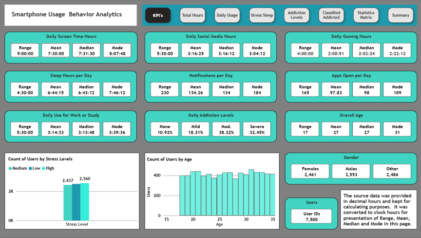
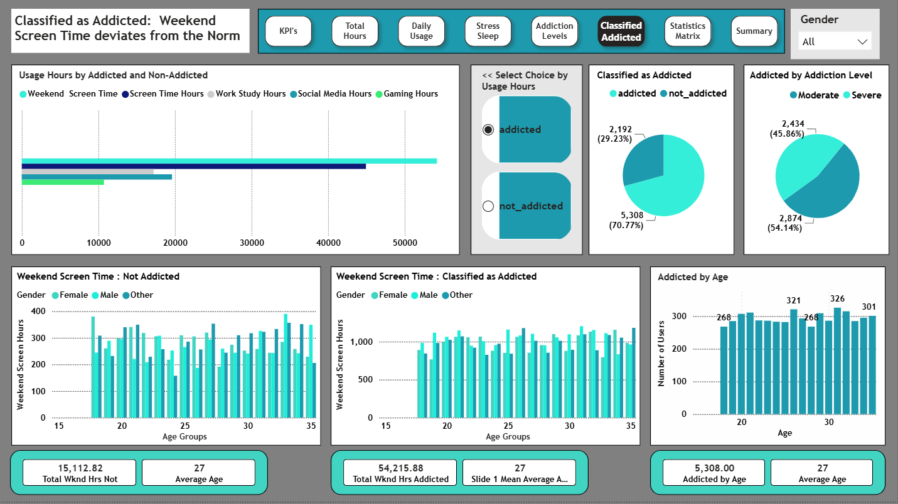
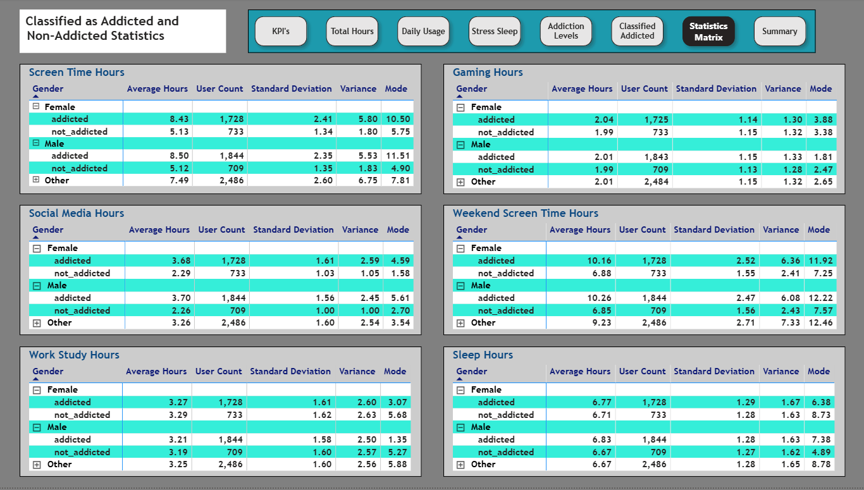

# Smartphone Usage Behavioral Analytics

## Business Problem

Identify behavioral indicators associated with excessive smartphone use and evaluate impacts on sleep, stress, and productivity.

## Project Overview

### Smartphone Usage Analysis - Interactive Dashboard 
**[Click here to interact with the live Power BI Dashboard](https://app.powerbi.com/view?r=eyJrIjoiNDRiMzE3MzktODA0My00NTUxLWI1NTgtM2E2ZGFiYmM4Y2I0IiwidCI6ImM5NjMyMDlmLTk1YTktNGYzYy1iNTU4LTBmOTQzM2MzYjhhNSJ9)**

This project analyzes smartphone usage behavior and addiction indicators across a dataset of 7,500 users. 

The analysis explores:

- Screen time trends
- Social media usage
- Sleep patterns
- Stress levels
- Addiction classifications
- Work and academic impact

## Tools Used

- MySQL Workbench
- Power BI
- Excel

## Key Findings

- Over 70% of users were classified as addicted.
- Average daily screen time exceeds 8 hours.
- Weekend screen time exceeds 9 hours on average.
- Smartphones addiction correlated with increased screen time and social media usage.

## Recommendations

- Implement screen time controls.
- Encourage healthier work-life balance.
- Increase awareness of smartphone usage habits.

## Files Included

 |  File  |  Description  |
 |  :---  |  :--- |
 |  Smartphone_Usage_Analysis.pbix  |  Power BI dashboard  |
 |  MySQL_Queries.sql  |  SQL analysis and validating  |
 |  Smartphone_Usage_Dataset.xlsx  |  Original data, Power BI changes and Cleaned data  |
 |  Executive_Summary.pdf  |  Project report  |

## Dashboard Preview
Main page of dashboard:
 

## Demographics
Usage behavior by demographics:

##  Addiction Metrics
Usage and demographics by addicted and non-addicted:

## Addiction Statistics Matrix
Statistical metrics of addicted and non-addicted by demographics and usage:

## Author

Scott Fike

