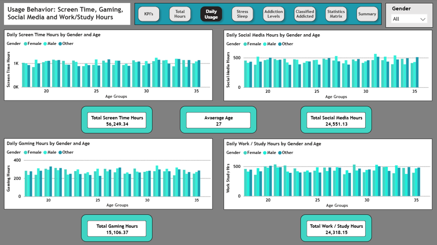

# Smartphone-Usage-Analysis
Data analysis project examining smartphone usage patterns and addiction indicators using MySQL and Power BI

# Smartphone Usage Behavioral Analytics

## Project Overview

This project analyzes smartphone usage behavior and addiction indicators using a dataset of 7,500 users

The analysis explores:

- Screen time trends
- Social media usage
- Sleep patterns
- Stress levels
- Addiction classifications
- Work and academic impact

## Tools Used

- MySQL Workbench
- Power BI
- Excel

## Key Findings

- Over 70% of users were classified as addicted.
- Average daily screen time exceeds 8 hours.
- Weekend screen time exceeds 9 hours on average.
- Smartphones addiction correlated with increased screen timeand social media usage.

## Files Included

 |  File  |  Description  |
 |--------------------------|
 |  Smartphone_Usage_Analysis.pbix  |  Power BI dashboard  |
 |  MySQL_Queries.sql  |  SQL analysis and validating  |
 |  Smartphone_Usage_Dataset.xlsx  |  Original data, Power BI changes and Cleaned data  |
 |  Executive_Summary.pdf  |  Project report  |

## Dashboard Preview
Main page of dashboard
 

## Demographics
Usage behavior by demographics

